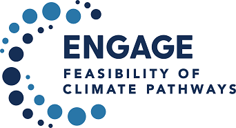

# ENGAGE - Analysis of net-zero budget scenarios

Copyright (c) 2021 IIASA Energy, Climate, and Environment Program

This repository is released under the MIT License;
see the [LICENSE](LICENSE) for details.

[](https://github.com/iiasa/ENGAGE-netzero-analysis/blob/main/LICENSE)
[](https://github.com/iiasa/ENGAGE-netzero-analysis)
[](https://github.com/psf/black)

## Overview



This repository contains Jupyter notebooks to generate figures and analysis
for the following manuscript:

> Keywan Riahi, Christoph Bertram, Daniel Huppmann, et al. <br />
> Cost and attainability of meeting stringent climate targets without overshoot <br />
> **Nature Climate Change**, 2021 <br />
> doi: [10.1038/s41558-021-01215-2](https://doi.org/10.1038/s41558-021-01215-2)

The scenario data used in this analysis should be cited as:

> ENGAGE Global Scenarios (Version 2.0) <br />
> doi: [10.5281/zenodo.5553976](https://doi.org/10.5281/zenodo.5553976)

The data can be accessed and downloaded via the **ENGAGE Scenario Explorer** at [https://data.ece.iiasa.ac.at/engage](https://data.ece.iiasa.ac.at/engage). 

Please refer to the [license](https://data.ece.iiasa.ac.at/engage/#/license)
of the scenario ensemble before redistributing this data or adapted material.

The source code of this notebook is available on GitHub
at https://github.com/iiasa/ENGAGE-netzero-analysis.  
A rendered version can be seen at https://data.ece.iiasa.ac.at/engage-netzero-analysis.

## About the ENGAGE project

ENGAGE is a global consortium, which explores the feasibility of pathways that can meet
the objectives of the Paris Agreement.
Visit http://www.engage-climate.org for more information!

## Dependencies

<div style="float: right; " >
<a href="https://pyam-iamc.readthedocs.io/">

</a>
</div>

The notebooks and scripts in this repository use **pyam**,
an open-source Python package for analysis and visualization
of integrated-assessment scenarios.
[Read the docs!](https://pyam-iamc.readthedocs.io/)

### Installation

To install the **pyam** package, simply run the following in a command line:

```
pip install pyam-iamc
```

This command also installs all other dependencies used in the notebooks and scripts. 

## Funding acknowledgement


This project has received funding from the European Union’s Horizon 2020 research
and innovation programme under grant agreement No. 821471 (ENGAGE).
