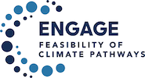

ENGAGE Netzero Analysis
=======================

Copyright (c) 2021 IIASA Energy, Climate, and Environment Program

|license| |python| |black|

.. |license| image:: https://img.shields.io/github/license/iiasa/ENGAGE-netzero-analysis
   :target: https://github.com/iiasa/ENGAGE-netzero-analysis/blob/main/LICENSE

.. |python| image:: https://img.shields.io/badge/python-3.7_|_3.8_|_3.9-blue?logo=python&logoColor=white
   :target: https://github.com/iiasa/ENGAGE-netzero-analysis

.. |black| image:: https://img.shields.io/badge/code%20style-black-000000.svg
   :target: https://github.com/psf/black

Overview
--------

This page shows rendered versions of Jupyter notebooks to generate figures and analysis
for the following manuscript:

   | Keywan Riahi, Christoph Bertram, Daniel Huppmann, et al.
   | Cost and attainability of meeting stringent climate targets without overshoot
   | **Nature Climate Change**, 2021
   | doi: `10.1038/s41558-021-01215-2 <https://doi.org/10.1038/s41558-021-01215-2>`_

The scenario data used in this analysis should be cited as:

   | ENGAGE Global Scenarios (Version 2.0)
   | doi: `10.5281/zenodo.5553976 <https://doi.org/10.5281/zenodo.5553976>`_

| The data can be accessed and downloaded via the **ENGAGE Scenario Explorer**
| at https://data.ece.iiasa.ac.at/engage.

Please refer to the `license <https://data.ece.iiasa.ac.at/engage/#/license>`_
of the scenario ensemble before redistributing this data or adapted material.

The source code of these notebooks is available
on `GitHub <https://github.com/iiasa/ENGAGE-netzero-analysis>`_.

Analysis notebooks
------------------

.. toctree::
   :maxdepth: 1

   notebooks/0_data_preparation
   notebooks/1_categorization
   notebooks/2.1_ENGAGE_Figure_1_emissions_temperature
   notebooks/2.2_ENGAGE_Figure_2_economic_implications
   notebooks/2.3_ENGAGE_Figure_3_netzero_emissions_systems
   notebooks/2.3_SI_ENGAGE_Figure_3_regional_netzero_emissions_systems

Dependencies
------------

.. figure:: https://github.com/IAMconsortium/pyam/raw/main/doc/logos/pyam-logo.png
   :width: 150px
   :align: right

The notebooks and scripts in this repository use **pyam**,
an open-source Python package for analysis and visualization
of integrated-assessment scenarios.
`Read the docs <https://pyam-iamc.readthedocs.io>`_!

About the ENGAGE project
------------------------

ENGAGE is a global consortium, which explores the feasibility of pathways that can meet
the objectives of the Paris Agreement.
Visit http://www.engage-climate.org for more information!

Funding Acknowledgement
-----------------------

.. figure:: _static/EU-logo.jpg
   :align: left
   :width: 80px

This project has received funding from the European Union’s Horizon 2020
research and innovation programme under grant agreement No. 821471 (ENGAGE).
